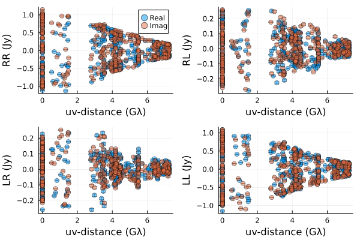
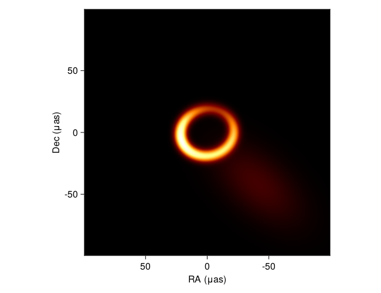
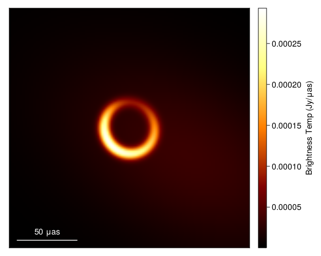
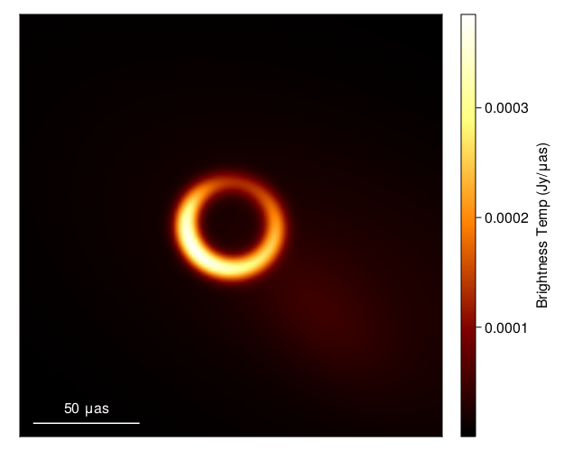

# EHT
Study for Event Horizon Telescope image processing

`PYTHON`
- ehtim (RMLE: Regularized Maximum Likelihood Estimation methods)

---

`JULIA`

- comrade.jl (Bayesian differentiable modular modeling framework)

